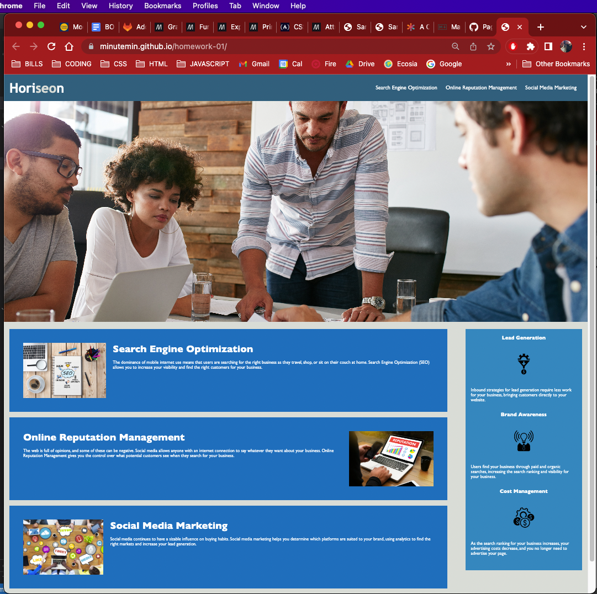

# Homework Assignment Challenge 1

HTML CSS Git Challenge: Code Refractor

GitHub: https://github.com/minutemin/homework-01

GitPages: https://minutemin.github.io/homework-01/

## Description ##

HTML CSS Git Challenge: Code Refractor

This assignment was designed to have students get more real world experiences by familiarizing themselves with the agile project management workflow.  We were asked to refactor an exisiting code in order to make it industry standards for user accessibility.  It focuses on refactoring code to include semantic elements and additional meta to make the website accessible for users that may have certain disabilities or for certain devices that assist user with disabilities.   It also give the student more practice with git, github, html, css and other things we learned in the first week. 

WHAT I DID:

First I created a new repo in my github and committed a README markdown file and license. Then I cloned it to my computer.  I then ran a git pull of the assignment file and copied and pasted it into a folder called homework-01.  After I worked on the code, meeting all of the acceptance criteria, I ran git pull to make sure I have updated version of the project.  I then git add -A and then git commit -m"" with message of my changes.  Then I pushed it to my github proceeded with a pull request and merge so that the new code could be merged into the main branch.  I turned on my git pages and copy and pasted the URL from there and from the Git Hub account and submitted them on BCS spot/Canvas.  

## Usage

To use this website, there are navigation bar at the top, which will direct you to the section below that refers to it.  

## Credits

Credit to whomever deserves it! 

## License

Licensed under the MIT license.
